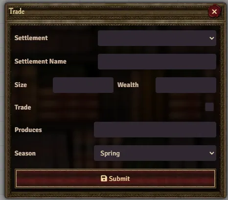
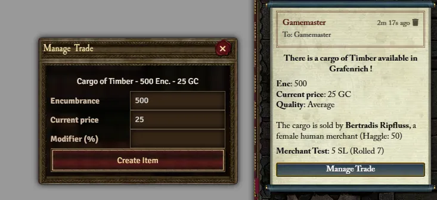

Trade (as defined in Death on the Reik and Sea of Claws) is a feature built into the WFRP4e system, however, all the data necessary to use it (gazetteers) is provided by those modules. 

## Partaking in Trade

There are two distinct Trade processes, **Buying** and **Selling**. There are also two types of trade, **Maritime** and **River**, though the only real difference between them is the internal processes that compute Trade generation. If you wish to learn the details of this, you can find them in the **Death on the Reik** module or the **Death on the Reik Companion** book for River trading, and **Sea of Claws** for Maritime. 

### Buying

The standard process of buying goods is initiated by the Gamemaster by typing `/trade` into chat. This will prompt you to select River or Maritime trading (if it doesn't prompt you, you only have one of them available to use). Once selected, you will see a Trade dialog. This is where you input the various parameters of Trade generation. If you select a settlement, these parameters will be filled in for you, though if you change them, the settlement will be deselected.

When submitted, this will either result in no trade being available, or a GM only message describing the goods available with the price, the merchant, and various other details. From here, you can click **Manage Trade** to modify the quantity and the price. Once satisfied, a new chat message will be created, prompting the players to buy the cargo if they desire. Payment will be automatically deducted from the player who clicked buy, and having done so, the cargo will be posted to chat. Like any other item, this can be dragged and dropped onto an Actor sheet.

{: .question}
When I try to buy cargo, it shows an error saying **Please assign a character.**

This means what it says, you have not assigned a character via Player Configuration (right click your name in the player list to access).

### Selling

To sell cargo, simply click the **Sell Cargo** button next to the Item on the Actor sheet. This will pull up the same Trade dialog as buying cargo and is filled in the same way. Once submitted, a chat message will notify you whether there are any potential buyers. From here the process is manual, if you wish to go through with selling simply delete the item and add the money agreed upon.
