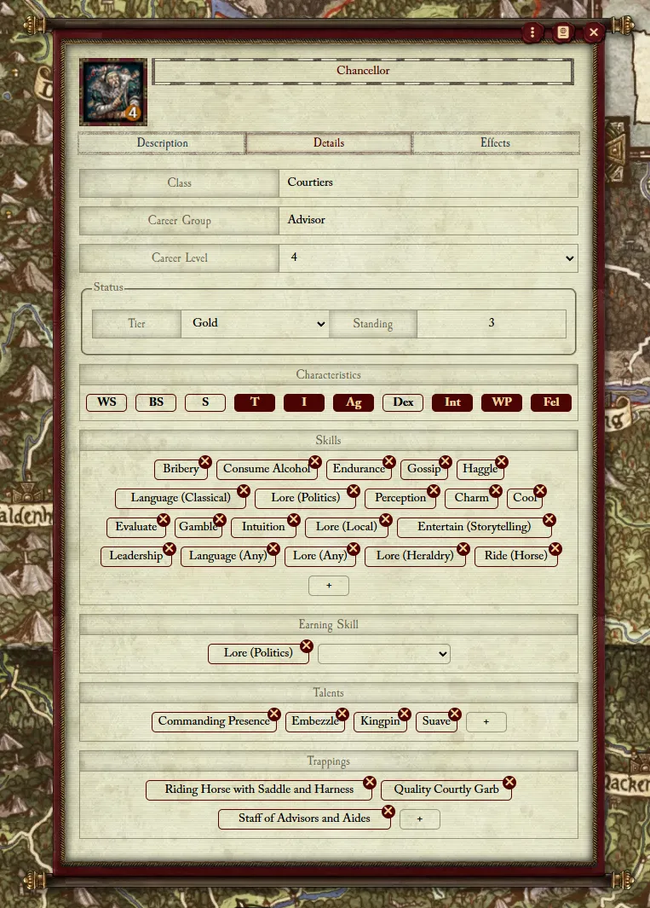
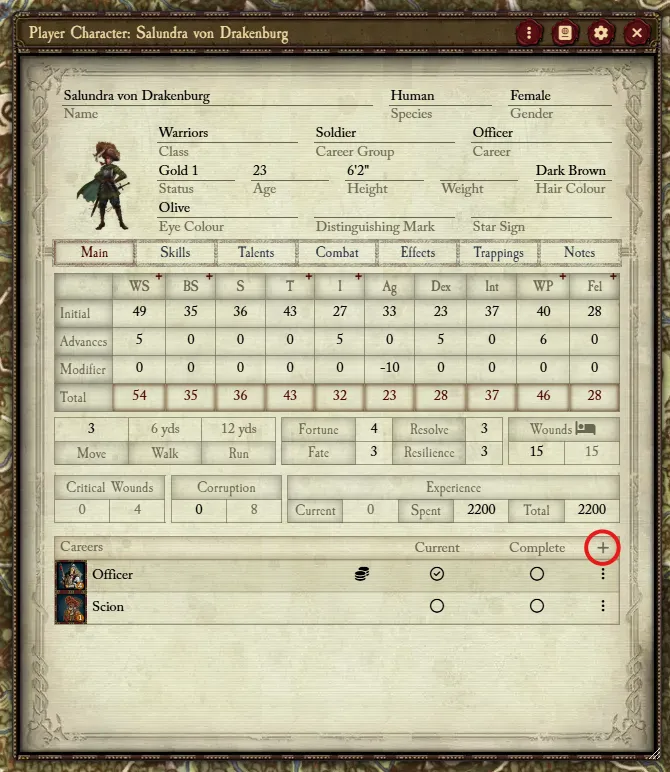
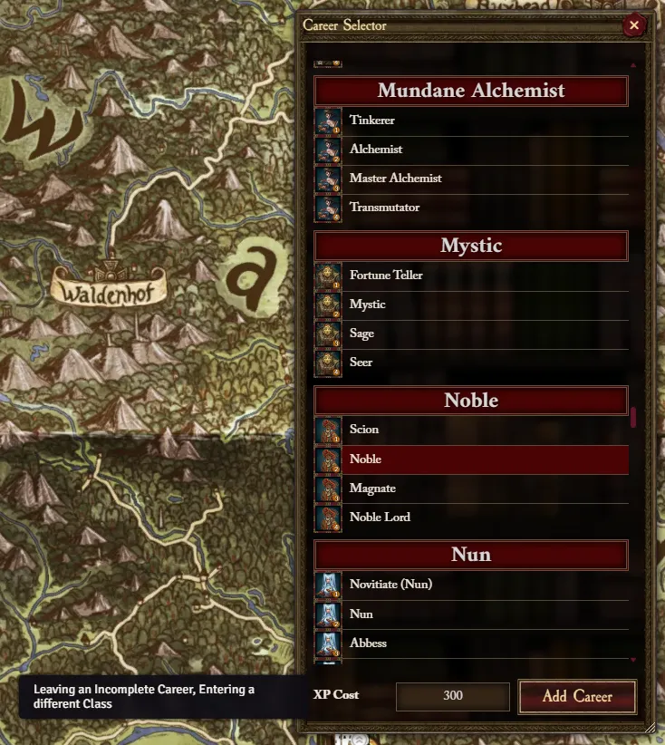
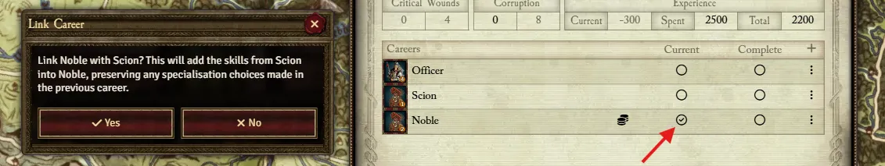
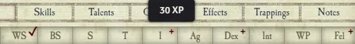

Careers are an integral part of the WFRP4e rules, so it's important to know how to use them correctly in Foundry. 

**Each Tier** of a Career is represented as an Item, i.e. *Aide*, *Advisor*, *Counsellor*, and *Chancellor* are each an Item, and they define in their data that they are part of the *Advisor* **Career Group**. This means that if a character were to progress from T1 to T4 in the Advisor career, they would add the correspending tier's Career Item to the Actor. 

{: .important}
> **Career Skills**
> 
> In the WFRP4e Rulebook, each Career Tier defines some set of skills, though any Tier is considered to have all the skills in previous Tiers as well. In Foundry, since each Career is a separate Item that has no inherent link to each other, the skills listed in each Tier include all of the ones before it. 
> 
> This is only really important if you're making your own Careers. For example, you create a T1 Career and fill out the characteristics, skills, talents, etc. When making the next tier, you should begin by copying the skills from T1 and transfering them to T2. When making T3, copy from T2 into T3, and so on. This ensures each Tier has all of the previous Tier skills. 
> 
> Below is a T4 Career, notice 20 skills defined, the first 18 being from T1, T2, and T3.

## Adding a Career

Like any Item, you can add a Career by dragging and dropping the Item from the World sidebar or the Compendium. However, under normal circumstances, it's recommended you use the **Career Selector**, which you can access from the Career list on the Main Tab. From here, you can select any Career from any available Class. The first Careers listed (here shown with a blue header) are in the same Class as your **Current Career**. Others (in red) are not. Selecting a Career will also calculate how much XP it will take to switch to that career, though this is editable if desired. When submitted, this will add the Career to the Actor and deduct the Experience.

### Current and Complete

Now that the Career is on the Actor, we can mark it as **Current**. Only one Career can be Current, and this lets you spend XP to advance Characteristics, Skills, and Talents according to the Career.

If a previous Career exists on the Actor that matches the new Career's group (Noble and Scion are both in the Noble Career), you will see a pop up prompting you to **Link Career**. What this will do is insert all the data from the previous Career into the new one. This is very important if the previous Career made any Skill specialisation choices. e.g. the choice to make **Melee (Any)** into **Melee (Polearm)**. Since each Tier is an indepedent Item, this Linking is necessary, otherwise you will have to manually go into the new Career's sheet and change any grouped Skill to match the choices made in the previous Tiers. 

A Career being **Complete** is a manual decision and not automated. All this does is affect XP calculation when changing career (+100 XP cost to switch Career if the **Current** one is not marked as **Complete**).

#### Advancement Indicators

Now that the Career is marked as **Current**, you can use the Advancement Indicators to advance and automatically spend XP. When the `+` becomes a `✓`, that means the Characteristic/Skill is advanced enough to be considered complete for this Career (5 × the Career Tier). 

{: .highlight}
> Note that you can **Force Advancement Indicators** for a Skill in its sheet. This will ensure the indicator shows regardless of current Career. Also note that by default XP for this advancing a forced Skill is double the normal rate, but XP cost can be modified as well in the sheet. 
> Otherwise, you can still advance a non-career Skill or Characteristic by simply editing the Advances value, this will prompt you to spend some calculated XP value, taking into account the extra cost for not being in the current Career, if applicable.