Combat is obviously going to ensue in most games set in the grim and perilous world of Warhammer, and the Foundry system aims to let you handle it with ease through various automated workflows. 

### Targeting 

Targeting the Tokens you intend to attack is the intended way to handle combat, but it isn't the only way. We'll discuss the advantages and disadvantages of other approaches. 

The easiest way to Target a token is hover over it and press `T`, this will create a targeting reticule around the Token for you. Other users will see a dot with the designated color for your user. 

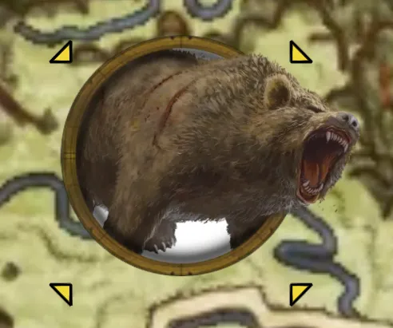
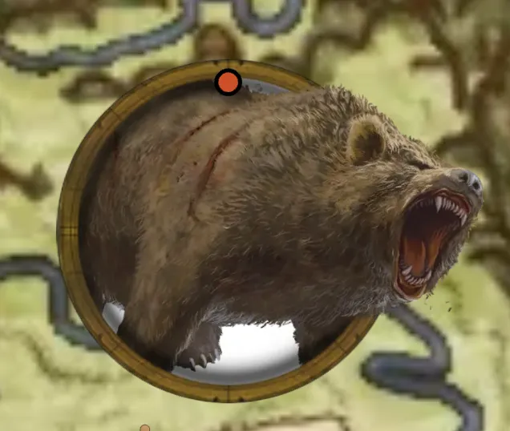

You can also double-right-click Tokens you don't own to Target them. It's worth noting that since GMs own all Tokens, they cannot use this method. 

## The Flow of Combat

Attacking an Actor is very simple. Target their Token and roll with some Item that does damage. This will generate a normal roll Chat Message as well as a targeting notification.

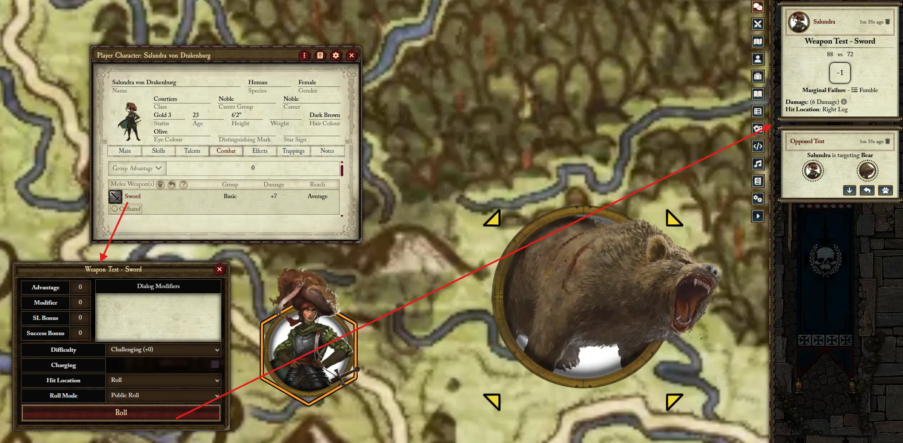

{: .highlight}
> While you can initiate an Opposed Test with any roll (such as characteristic or skill), only certain Items are capable of doing Damage as a result, like Weapons.
>
> Some users mistakenly just roll **Melee (Basic)** when they want to attack, this won't be able to do damage because the system doesn't know what Weapon you want to attack with. When using a Weapon in the Basic, the system knows to use your 
> Melee (Basic) skill

Now, it's time for the other Actor (the defender), to respond. This can be done with *any* roll. In fact, the next roll performed by the defender, whatever it is, is considered the defensive roll. So to do this, you can simply click on any characteristic, skill, trait, weapon, etc. on the defending Actor. 

However, there are shortcut buttons available on the targeting Chat Message, these are contextual based on what Items the defending Actor has. The name of the Item is shown in the tooltip.

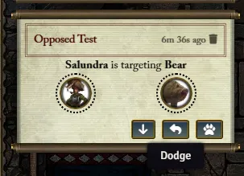

{: .important}
Remember that the attacker and defender are likely separate Users! If the GM uses an Actor to attack a Player's character, that Player can simply roll from their sheet or click the shortcut buttons in chat. 

After completing the defensive roll, you will see the opposed result in chat, and if the attacker won, the damage and the button to apply it. The **Apply Damage** button handles almost all the calculations required, including TB and AP reductions, AP Penetration, Ward saves, and much more. 

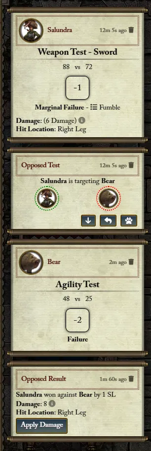

After applying, you can see the breakdown of modifiers in the result tooltip.

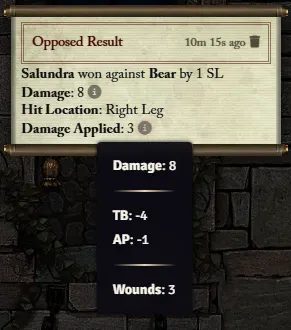

### Alternative Combat Flows

{: .important}
The standard method of targeting before rolling is preferable because the roll dialog tries to take into account any contextual modifiers that may apply to the roll. With the methods described below this will need to be done manually (usually via editing the test after it's rolled). 

#### Start Opposed - Target

You can target any Actor after-the-fact by targeting, right clicking your Test, and selecting **Start Opposed**. This will create an opposed test as if you had targeted them before you rolled, so the target simply needs to roll a Test to defend.

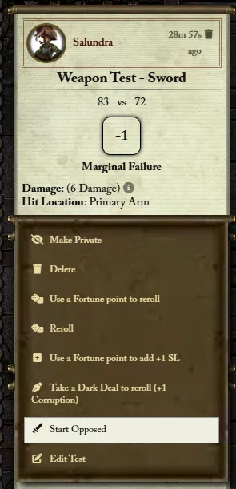

#### Start Opposed - No Target

When selecting **Start Opposed** without a Target, this starts an "open" opposed test that has no defender yet. To designate a defender, simply right click another Test and select **Defend Opposed**. This completes the opposed test and compares the attacker and defender, generating a result card. 

{: .important}
Note that this method *cannot* (usually) be used for Ranged Attacks (or any unopposed attack), as it involves using two different rolled Tests. Use the targeting alternative above for these cases. 

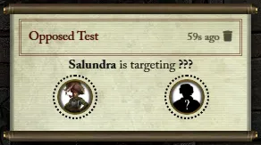

## Spells & Prayers

Usings Spells and Prayers is usually straightforward and works the same way as Weapons, but overcasting can cause some complications with targeting, see the example below.

{: .question}
I have cast a spell, targeting the Actor I wish to cast it at. However, I have 3 overcasts, allowing me to select more Targets, how do I resolve this?

See the [Alternative Comabt Flows](./combat.md#alternative-combat-flows), this lets you create more opposed tests off of your Casting Test against different targets, from these opposed tests you can proceed each one as unopposed. 

{: .question}
Is there an easier way to handle multiple targets than doing them one by one?

Yes! After Casting the spell, simply target all the targets you wish (hold shift while clicking `T` to target multiple), then right click the Casting Test and select **Start Opposed**, this will create an Opposed Test for each target.

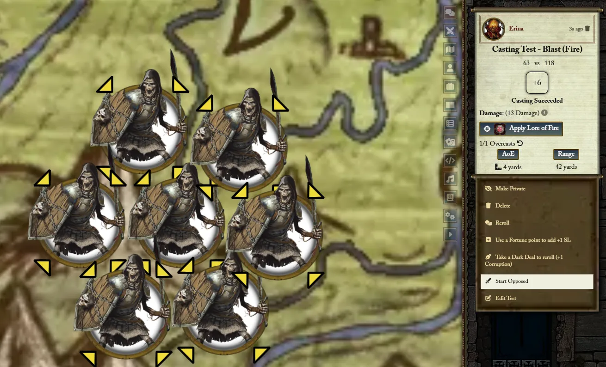

Then, assuming all the Tests can be resolved unopposed, right click the Casting Test again and select **Complete All Unopposed**.

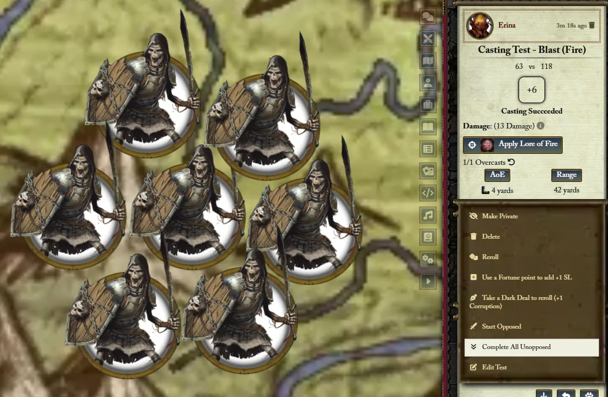

Finally, right click the Casting Test once  more and select **Apply All Damage**.

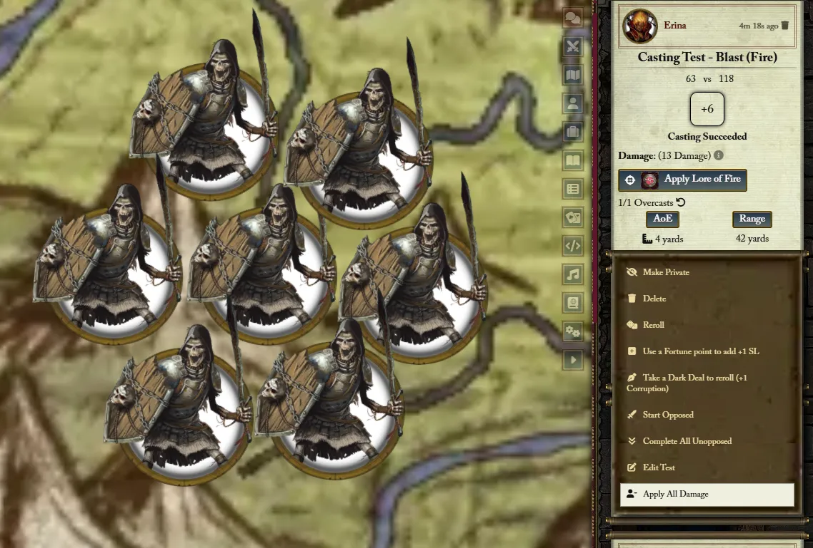

## Other Considerations

### Dual Wielder 

The **Dual Wielder** Talent describes a very specific process for its usage, and here's how to perform it in the Foundry system.

1. Ensure you have the **Dual Wielder** Talent
2. Ensure you have two weapons equipped, with one of them mark as **offhand**

    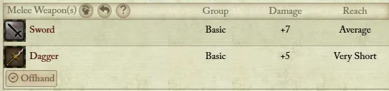

3. Attack with the primary weapon as normal (not the offhand weapon). 
4. After completing the opposed test with the primary weapon, there will be a **Roll Dual Wielder Attack** button on the result card. 

    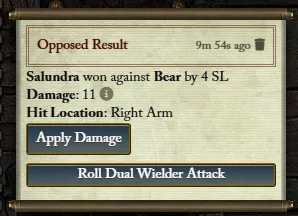

5. Target the Actor you wish to attack with the secondary weapon, then click the button to proceed with the secondary weapon Test. 

{:.important}
Note that even if it seems like it's starting a new roll for the secondary Test, the roll will be set to the reverse of the primary roll. The roll dialog is necessary to account for any modifiers to the secondary target. 
