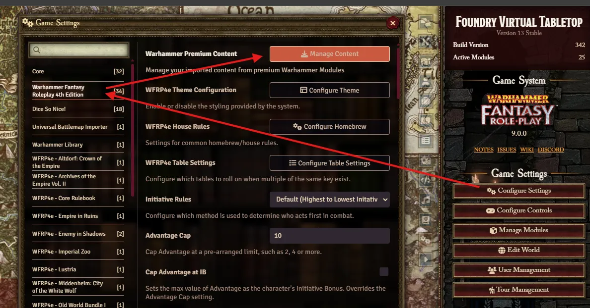
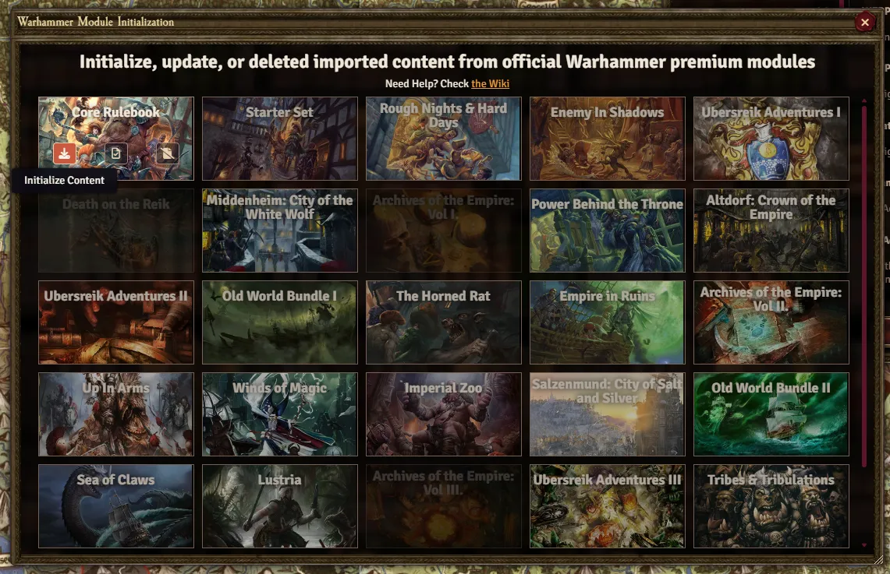

There are four steps to take in acquiring and using Premium Content: Buying, Registering, Installing, and Activating

### Buying

The first step to acquiring a premium module (for any system) is purchasing a key; this is completely handled by the content provider. In this case, you can purchase the premium modules at [Cubicle 7's Webstore](https://cubicle7games.com/foundry-vtt-virtual-tabletop-games).

Once purchased, you will receive a key via email (or listed in your C7 account details).

{: .question}
I didn't receive a key!

I have no ability to handle troubleshooting related to issues with purchasing or fulfillment of keys. Please contact Cubicle 7 support at [sales@cubicle7games.com](sales@cubicle7games.com)

### Registering

Once you've received your key, it's time to register it with Foundry! This tells Foundry VTT you're authorized to download and use the purchased module. 

1. First, you need to have an account with Foundry VTT, this should already be the case if you have the Foundry software. 
2. Once you've logged into your account, go to [your profile](https://www.foundryvtt.com/me) and select **Purchased Content**
3. There you'll find a place to enter your key, once you've done so, you should receive a confirmation message.

### Installing

Once you've registered your purchased module, you can install it in your FoundryVTT software! To do so, simply go to the **Setup** screen of Foundry, navigate to the **<i class="fas fa-plug tab-icon"></i> Add-on Modules** tab, and then click the **<i class="fas fa-download"></i> Install Modules** button. This opens up the Module Browser, which lists every module available to download, so you'll need to search for the module you purchased. Once found, click the **<i class="fas fa-download"></i> Install** button to begin downloading.

{: .question}
It says I don't own the module! 

If you see **<i class="fas fa-lock"></i> Not Owned** next to the module you purchased, don't fret, sometimes it takes time for your software to reflect your purchase. Try restarting your server, if available. Regardless, it will show up eventually.

### Activating

Now, you've installed the module onto your Foundry software, but it doesn't just assume you want to use it in all your worlds, so now we need to activate the module to use in your game. 

1. Launch the world you want to use the module with.
2. Once loaded, go to the **<i class="fas fa-cogs"> </i> Settings** tab.
3. Click the **Manage Modules** button. 
4. Find the desired module, and click the checkbox next to it.
5. Click **Save Module Settings**

{: .question}
I still don't see any Actors or Items!

Content provided by modules is always delivered via the Compendium, check the <i class="fas fa-atlas"></i> Compendium Tab to see all the compendium packs available.

---

### Initializiation 

The process above is universal for all Foundry modules, the Warhammer modules goes through an additional, optional step of **Initialization**

When learning Foundry, it is important to understand what exactly the Compendium represents. Compendium packs are **databases** intended for storage and content delivery for Modules, such as the premium WFRP4e modules, which all have Compendium Packs that contain all the Actors, Items, Journals, etc. When inside a Compendium, these Documents are not loaded by clients, as such, thousands and thousands of Documents can exist with minimal impact on the world's load time. 

Documents that instead have been imported into the World appear in the other sidebar tabs, and are considered *actively used*. These documents are loaded into memory by all clients, so as users connect to the world, the server has to send all Document data (all the Actor's stastics and descriptions, Journal text, Item data) to each one of them. If thousands of these Documents exist, there could be significant load time when trying to connect to the world, especially if the upload speed of the server or download speed of the client is low. 

{: .important}
Users are any connecting client, there's no difference between GM and Player.

Read more about Compendium Packs [here](https://foundryvtt.com/article/compendium/).

**Initialization** is a process that each of the WFRP4e modules goes through that imports certain Documents from the Compendium into the world. What Documents are imported is dependent on the Module. In general: all modules import their Journal Entries, Tables, and Scenes. Modules that are "adventures" in nature import their Actors as well. 

<strong>To initialize the modules you have purchased</strong>, find the System Settings, and open the Initialization window. 

Here you will see all premium modules available. For ones owned, installed, and activated, you can initialize them. Once initialized, 2 more options will be available. These are **Update** and **Delete**. This will modify Documents imported into the world via initialization accordingly. 

{: .important}
> Many functions within the WFRP4e System have imported Documents take precedence over Documents within the Compendium. This lets GMs import these Documents to make changes to them, and the system will use these edited versions. 
> 
> For example, if the GM imports the Hardy Talent and modifies it, then a Player purchases the Hardy Talent from their character sheet, it will take the imported version over the Compendium version. 

If you want to import more Documents, you can either drag and drop them from the Compendium pack into their respective tabs, right click the Compendium document and click **<i class="fas fa-download fa-fw"></i> Import Entry**, or right click the whole Compendium and click **<i class="fas fa-download fa-fw"></i> Import All Content**. It is best practice to only import the content you foresee actively using, and there is not much point in importing Items unless you wish to modify them. 

### Updates (Reinitialization)
Updating modules do not reflect any changes to the content on your imported content, as the content within the world itself belongs to *you*. The Compendium packs come directly from the module, so changes in content from updates will be seen there. So how can you receive the updates in the world for your imported contents?

- Check the [release notes](https://github.com/moo-man/WFRP4e-FoundryVTT/releases) and determine if the update is worth importing into your world. This is typically listed under **Official Modules**.
- Delete the content imported from the module
- Go to **Configure Settings**, find the module you wish to import from, click the **Setup** button, then **Initialize**

**For Example**: I want to update my imported Core Rulebook Documents. Looking through the tabs, I see **Scenes (Core Rulebook)**, **Journals (Core Rulebook)**, and **Tables (Core Rulebook)** folder. After verifying each of these folders has none of my custom content inside, I can right click each folder and select <strong><i class="fas fa-dumpster fa-fw"></i> Delete All</strong>. I've also imported a few Documents from the <strong>Bestiary (Core Rulebook)</strong> for use in my game, let's say the **Goblin**, **Boar**, and **Hydra**. I delete the Goblin and Boar, but not the Hydra, as I've heavily customized it for my adventure. Once I'm sure all the Documents to be updated have been deleted, I go to the Module's Settings, open the **Setup** menu, then click **Initialize**. Once complete, I import the **Goblin** and **Boar** fresh from the Compendium.